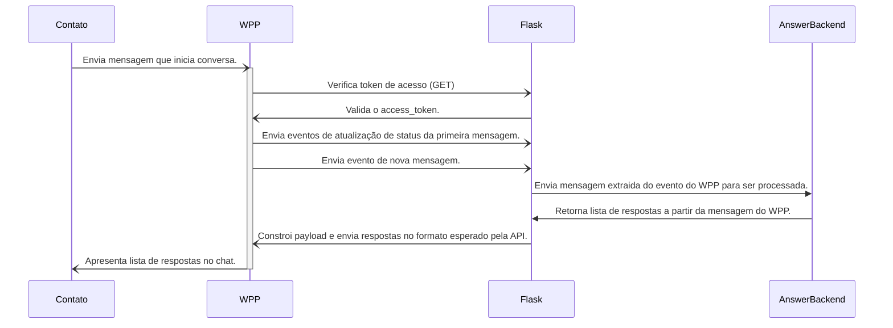

API Flask que permite receber webhooks do WhatsApp API Cloud. O código está modularizado
de forma que é possível reutilizar partes da implementação em backends diversos, como
uma API DRF ou o backend Python (actions e conectores) de uma instância do [Rasa Open Source](https://rasa.com/docs/rasa/actions/).

# Quick Start

Instale o gestor de dependências Poetry:

    curl -sSL https://install.python-poetry.org | python3 -

Crie um virtualenv com a versão 3 do Python:

    poetry env use python3

Habilite o virtualenv:

    poetry shell

Instale as dependências:

    poetry install

Inicialize o servidor:

    python3 -m flask --app server run -p 5006

# Arquitetura

Apesar da implementação utilizar um servidor Flask para disponibilizar a URL que receberá
os webhooks, o arquivo `server.py` é um exemplo de como implementar o fluxo para
receber eventos do WhatsApp, processá-los e enviar uma requisição de volta para o WhatsApp 
com a resposta para o contato que iniciou a conversa. Basicamente, o `server.py` segue
o seguinte fluxo:



Note que o `AnswerBackend` pode ser qualquer componente de software que sabe o que fazer
com uma mensagem enviada pelo contato. A API Flask irá intermediar a conexão do WhatsApp
com esse serviço.

# Integração no WhatsApp

Todas as mensagens respondidas pelo Rasa serão convertidas para o padrão JSON
esperado tanto pela API do Serpro quanto pela API do Cloud API. Isso implica que
o Rasa é independente do canal em que ele está conectado. No momento, todos os textos 
e botões definifidos no arquivo de domínio são enviados para o WhatsApp na integra, com
execeção de mensagens que utilizem mais de três botões.

A API do WhatsApp não permite mensagens do tipo interativo terem mais de três botões, 
mas isso não é um limitação do Rasa. Por isso, quando o canal for o WhatsApp, os módulos
de integração irão converter mensagens com mais de três botões para o tipo interativo
de lista.

## WhatsApp Cloud API

**1. Solicite um número de testes**

A integração com o WhatsApp utiliza a [Cloud API do Meta](https://developers.facebook.com/docs/whatsapp/cloud-api/get-started#configure-webhooks).
É preciso seguir as instruções da documentação para criar uma conta de desenvolvedor e
um aplicativo do tipo Empresa. Com isso feito, basta configurar o webhook no painel
de desenvolvedor utilizando a URL do Ngrok, para receber os eventos de mensagem.

**2. Atualize as variáveis de ambiente**

O Rasa permite ao desenvolvedor implementar endpoints customizados para receber eventos
de canais que não são suportados oficialmente. No arquivo `bot/addons/custom_channel.py` 
está a o endpoint responsável por receber os eventos do Cloud API.

O processo de extrair as mensagens dos eventos do WhatsApp é feito utilizando os
módulos do repositório [whatsapp_api_integration](https://gitlab.com/pencillabs/ej/whatsapp-api-integration).
É preciso clonar esse repositório dentro do diretório `bot/addons`.
O endpoint utiliza esses módulos para enviar o texto digitado pelo usuário para o
componente do Rasa responsável pelo processamento de linguagem natural.

Com a conta de desenvolvedor configurada, atualize o arquivo `variables.env` 
com os valores disponibilizados no painel do Facebook.
 
```
WPP_AUTHORIZATION_TOKEN=<token de authorização do WhatsApp para API de mensagens>
WPP_VERIFY_TOKEN=<token de verificação aleatório>
WPP_PHONE_NUMBER_IDENTIFIER=<identificador do número de telefone de testes>
```

Após alterar as variáveis, reinicie o módulo actions e a API do Rasa.

**3. Configure o webhook**

No ambiente local, a URL https pode ser gerada com o projeto [Ngrok](https://ngrok.com/).
Você precisará apontar para a porta `5006`, que é a porta utilizada pela API do Rasa.

```shell
$ ./ngrok http 5006
```

No painel de desenvolvedor, inclua a URL https do Ngrok com a subrota `/webhooks/whatsapp/webhook`
para o endpoint do WhatsApp. Não esqueça de habilitar os eventos de webhook no painel de desenvolvedor,
caso contrário, mesmo enviando mensagens na conversa, a API do rasa não receberá nenhuma requisição.


**4. Teste a conexão**

Com o número de teste e o número do destinatário, teste a comunicação do WhatsApp com o
Rasa em uma conversa entre ambos os números. Envie `/start ID-DA-CONVERSA-NA-EJ` na
conversa e verifique se a requisição irá chegar no Rasa por meio da URL do Ngrok.

## Serpro

A implementação desse repositório também suporta receber eventos da [API do Serpro para
integração com WhatsApp](https://gitlab.com/pencillabs/ej/ej-application/-/merge_requests/307).
Essa integração é especialmente util para cenários de uso governamental, em que é necessário
utilizar um parceiro credenciado pela Meta para acesso às API de mensagem.

**1. Solicite as credenciais**

Para utilizar esse modo de integração, é preciso que a equipe do Serpro envie as seguintes
credenciais:

- Client ID
- Secret
- Phone Number Id
- Waba ID

Com as credenciais, atualize o arquivo `variables.env`:
```
SERPRO_CLIENT_ID=138808512639290
SERPRO_CLIENT_SECRET=kLaVl2fSevwX4EdESxXC8J1W462XVXLP
SERPRO_WABA_ID=110115228401530
```

**2. Configure o Rasa para receber os eventos.**

A API do Serpro irá enviar os eventos do WhatsApp para a instância do Rasa na rota
`/webhooks/whatsapp/webhook`. Para desenvolvimento local, é possível criar um servidor
na nuvem e realizar uma configuração de [tunelamento para o servidor](https://gist.github.com/gdamjan/4586758). 
Em produção/homologação, o Rasa precisará estar rodando na máquina virtual que 
responderá ao domínio de webhook.


**3. Registre o webhook pela API do Serpro.**

Com as credenciais e a infraestrutura para recebimento dos eventos disponível, é preciso
cadastrar o webhook na API do Serpro. O método `register_webhook` do módulo
`bot/addons/whatsapp_api_integration/serpro_api_client.py`, pode ser utilizado para
a criação do webhook a partir das credenciais enviadas pelo Serpro.

