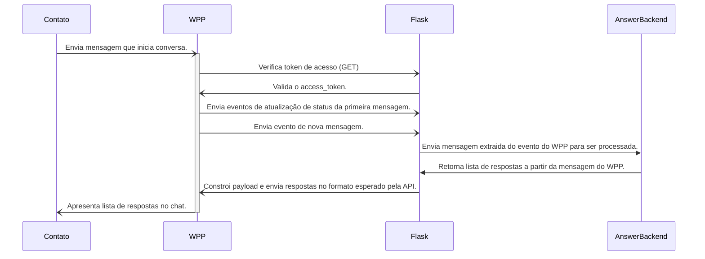

API Flask que permite receber webhooks do WhatsApp API Cloud. O código está modularizado
de forma que é possível reutilizar partes da implementação em backends diversos, como
uma API DRF ou o backend Python (actions e conectores) de uma instância do [Rasa Open Source](https://rasa.com/docs/rasa/actions/).

# Quick Start

Instale o gestor de dependências Poetry:

    curl -sSL https://install.python-poetry.org | python3 -

Crie um virtualenv com a versão 3.12 do Python:

    poetry env use 3.12

Habilite o virtualenv:

    poetry shell

Instale as dependências:

    poetry install

Inicialize o servidor:

    python3 -m flask --app server run -p 5006

# Arquitetura

Apesar da implementação utilizar um servidor Flask para disponibilizar a URL que receberá
os webhooks, o arquivo `server.py` é um exemplo de como implementar o fluxo para
receber eventos do WhatsApp, processá-los e enviar uma requisição de volta para o WhatsApp 
com a resposta para o contato que iniciou a conversa. Basicamente, o `server.py` segue
o seguinte fluxo:

Note que o `AnswerBackend` pode ser qualquer componente de software que sabe o que fazer
com uma mensagem enviada pelo contato. A API Flask irá intermediar a conexão do WhatsApp
com esse serviço.

# Enviando mensagens para o WhatsApp

Para testar a API Flask em uma conversa no WhatsApp, é preciso seguir a [documentação
do Facebook](https://developers.facebook.com/docs/whatsapp/cloud-api/get-started) para desenvolvedores. Você precisa:

1. Criar uma conta de desenvolvedor.
2. Criar um app do tipo empresa.
3. Adicionar o produto WhatsApp ao app.
4. Adicionar um número de destinatário.
5. Enviar uma mensagem de teste.

No passo 5, você precisa configurar uma URL HTTPS para que o WhatsApp te envie os eventos
via webhook. Caso você esteja fazendo a configuração em ambiente local, recomendamos a
ferramenta [ngrok](https://ngrok.com/) para realizar o tunelamento HTTPS para a API Flask local.
